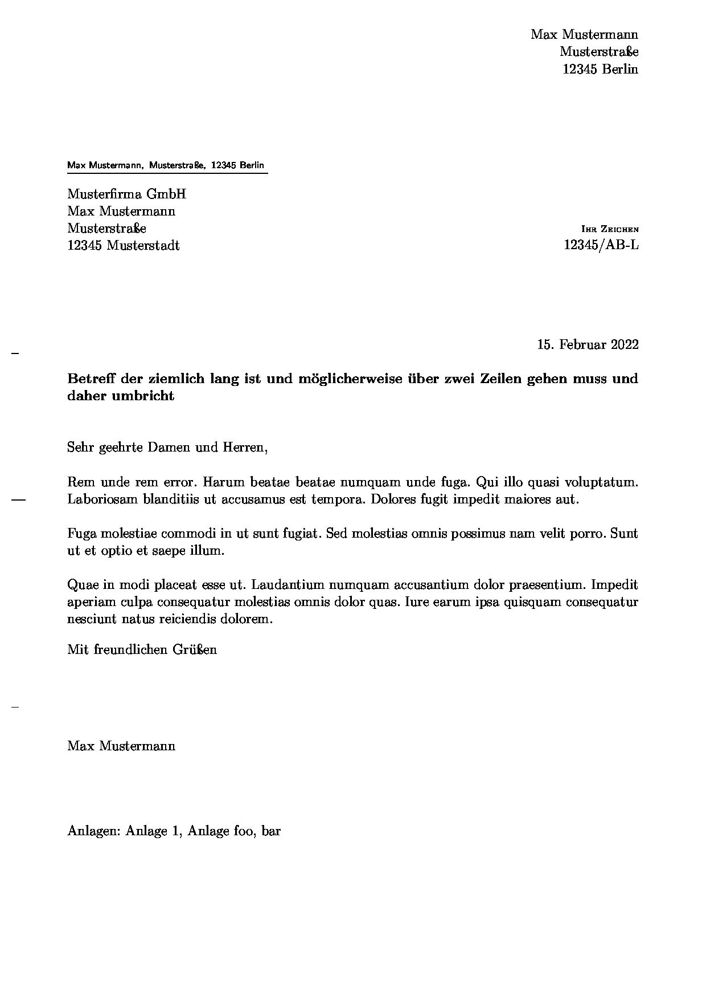

# Pandoc Template für DIN-5008B konforme Briefe

Inspiriert von [benedictdudel / pandoc-letter-din5008](https://github.com/benedictdudel/pandoc-letter-din5008/)

## Beispiel

(Schlechte Bildqualität durch JPG Compression)



## Verwendung

```bash
pandoc eingabe.md -s -o ausgabe.pdf --template="/pfad/zum/letter-template.tex"
```

Alternativ kann das Template in das Pandoc-Templates Verzeichnis kopiert werden, um ohne Dateipfad darauf zuzugreifen. Siehe https://pandoc.org/MANUAL.html#option--data-dir

### Optionale YAML Header

Die Keys `ref` ("Ihr Zeichen") und `encludes` ("Anlagen") sind optional.
